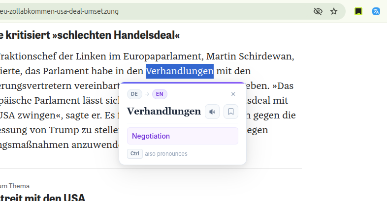

# TransWord  — A word translation Chrome extension for language learners

A lightweight chrome-like browser extension designed for language learners. 
Double-click any word on a webpage to see an instant translation, hear its pronunciation, and save it to your personal vocabulary list.

## Features

- **Instant Translation**: Double-click any word to trigger a popup translation.
- **Automatic Language Detection**: Powered by the myMemory API, the extension automatically detects the source language.
- **Text-to-Speech (TTS)**: Hear the word pronounced by clicking the speaker icon or pressing the `Ctrl` key.
- **Vocabulary Bookmarks**: Save interesting words to your local storage with a single click on the bookmark icon.
- **CSV Export**: Manage your learning by exporting your bookmarked words (including word, translation, source language, and date) to a CSV file.
- **Customizable Target Language**: Set your preferred target language (English, German, French, Spanish, or Chinese) via the toolbar popup.
-  Using https://api.mymemory.translated.net/ for translation 
## Installation
1.  Clone this repository or download the source code to your local machine.
2.  Open Google Chrome (or any Chromium-based browser like Edge or Brave).
3.  Navigate to `chrome://extensions/`.
4.  Enable **Developer mode** using the toggle in the top right corner.
5.  Click **Load unpacked** and select the project directory.

## Usage

### Translating & Learning
- **Translate**: Double-click any word on any website.
- **Pronounce**: Click the speaker icon in the popup or press the `Ctrl` key while the popup is visible.
- **Bookmark**: Click the bookmark icon to save the word and its translation. The icon will highlight when a word is saved.
- **Close**: Click the `✕` button or press `Esc`.

### Settings & Export
1.  Click the extension icon in your browser toolbar (pin it for easier access).
2.  **Change Language**: Select your desired target language from the dropdown. This takes effect immediately for new translations.
3.  **Export Data**: Click **Export Bookmarks (CSV)** to download your saved vocabulary. This file can be imported into tools like Anki or Excel.

## License

GPLv3

## Screenshots

## Author
drhlxiao
